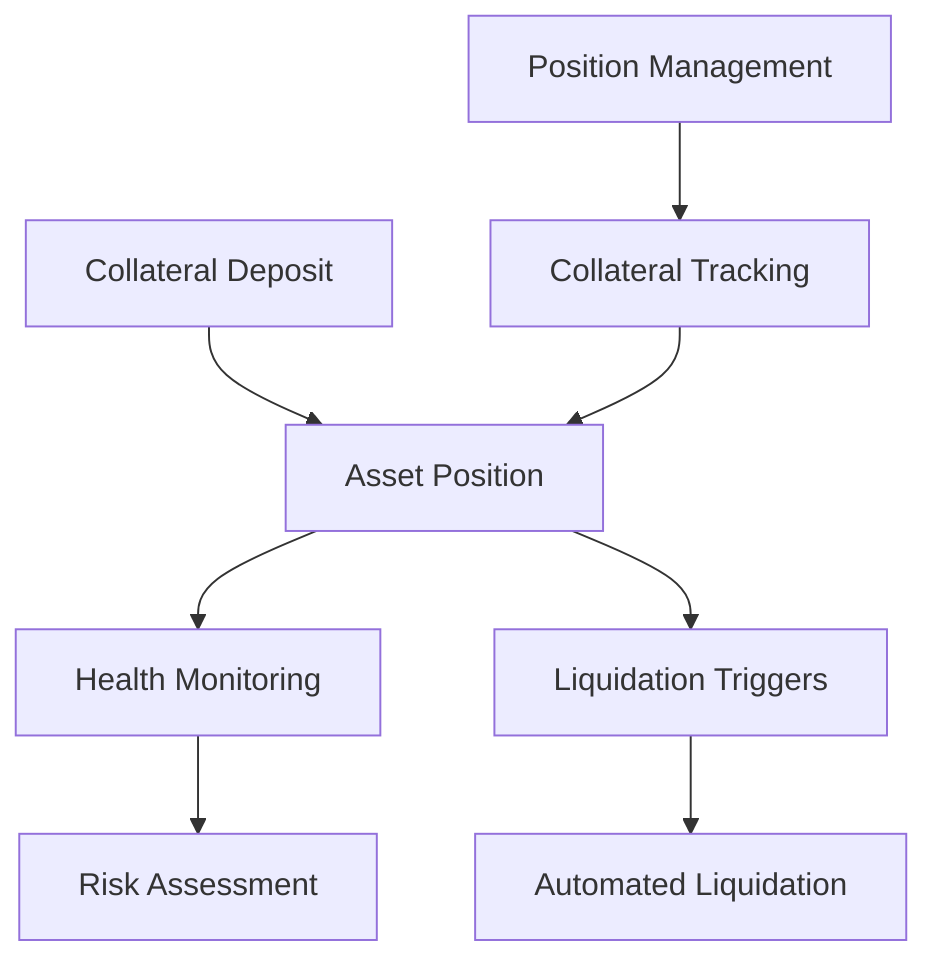

# Collateral Sentinel

A decentralized smart contract platform for robust collateral management and tracking on the Stacks blockchain.

## Overview

Collateral Sentinel provides a secure, transparent mechanism for managing digital asset collateralization, offering:

- Immutable collateral position tracking
- Transparent liquidation mechanisms
- Real-time collateral health monitoring
- Decentralized risk assessment
- Automated collateral management

## Architecture

The Collateral Sentinel platform uses a core smart contract to manage collateral positions, track asset health, and facilitate liquidation processes.



### Core Components

1. **Position Management**: Handles collateral deposit and tracking
2. **Risk Assessment**: Monitors asset health and collateralization ratios
3. **Liquidation System**: Manages automated liquidation triggers
4. **Tracking Mechanism**: Provides transparent and immutable position records

## Contract Documentation

### sentinel-vault.clar

The primary contract managing collateral positions and associated mechanisms.

#### Key Features

- Collateral deposit and withdrawal
- Position health tracking
- Liquidation threshold management
- Transparent asset tracking
- Risk assessment algorithms

#### Access Control

- Users can deposit and manage collateral
- System can trigger liquidations based on predefined rules
- Contract maintains immutable tracking of positions

## Getting Started

### Prerequisites

- Clarinet
- Stacks wallet for interaction

### Installation

1. Clone the repository
2. Install dependencies with Clarinet
3. Deploy contracts to the Stacks network

### Basic Usage

```clarity
;; Deposit collateral
(contract-call? .sentinel-vault deposit-collateral u1000 "BTC")

;; Check position health
(contract-call? .sentinel-vault get-position-health tx-sender)

;; Update collateral allocation
(contract-call? .sentinel-vault update-collateral-allocation u500 "ETH")

;; Trigger liquidation check
(contract-call? .sentinel-vault check-liquidation tx-sender)
```

## Function Reference

### Public Functions

#### `deposit-collateral`
```clarity
(define-public (deposit-collateral 
    (amount uint) 
    (asset-type (string-utf8 20))))
```
Deposits a specified amount of an asset as collateral.

#### `withdraw-collateral`
```clarity
(define-public (withdraw-collateral 
    (amount uint) 
    (asset-type (string-utf8 20))))
```
Withdraws collateral from the user's position.

#### `update-collateral-allocation`
```clarity
(define-public (update-collateral-allocation 
    (amount uint) 
    (asset-type (string-utf8 20))))
```
Updates the allocation of a specific asset in the collateral position.

#### `check-liquidation`
```clarity
(define-public (check-liquidation (user principal)))
```
Triggers a liquidation check for a user's position.

### Read-Only Functions

#### `get-position-health`
```clarity
(define-read-only (get-position-health (user principal)))
```
Retrieves the health status of a user's collateral position.

#### `get-collateral-balance`
```clarity
(define-read-only (get-collateral-balance 
    (user principal) 
    (asset-type (string-utf8 20))))
```
Retrieves the balance of a specific asset in a user's collateral position.

#### `get-liquidation-status`
```clarity
(define-read-only (get-liquidation-status (user principal)))
```
Checks the liquidation status of a user's collateral position.

## Development

### Testing

Run tests using Clarinet:

```bash
clarinet test
```

### Local Development

1. Start a local Clarinet console:
```bash
clarinet console
```

2. Deploy contracts:
```bash
clarinet deploy
```

## Security Considerations

### Limitations

- Collateral positions are subject to liquidation
- Asset types must be pre-approved
- Position health is dynamically calculated
- Liquidation thresholds are system-defined

### Best Practices

1. Maintain a healthy collateral ratio
2. Diversify collateral assets
3. Monitor position health frequently
4. Be prepared for potential liquidation events
5. Understand the risks of over-collateralization

### Data Validation

- Collateral amounts must be positive
- Asset types must be approved by the system
- Withdrawal amounts cannot exceed deposited balance
- User must maintain minimum collateralization ratio